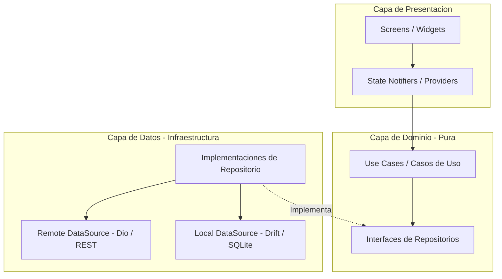

# 📐 Subdocumento 01: Arquitectura del Sistema, Capas y Patrones de Diseño

Este documento profundiza en la estructura arquitectónica de la aplicación de **Preventas**, detallando el flujo de dependencias, la separación de responsabilidades y la justificación técnica de los patrones de diseño aplicados.

---

## 🏛️ 1. Principios Arquitectónicos Fundamentales

La aplicación implementa los principios de **Clean Architecture** (Robert C. Martin) combinada con una organización **Feature-First / Layered**:



### 🎯 Principios Clave Aplicados

1. **Inversión de Dependencias (Dependency Inversion Principle - DIP):**
   - La capa de **Dominio** no depende de la capa de **Datos** ni de la **Presentación**. Define sus propios contratos de repositorio (`AuthRepository`, `SyncRepository`).
   - Las implementaciones concretas (`AuthRepositoryImpl`, `SyncRepositoryImpl`) residen en la capa de **Datos** y dependen del contrato de dominio, invirtiendo el sentido tradicional de la dependencia.

2. **Aislamiento del Framework:**
   - La capa de **Dominio** no contiene importaciones de Flutter UI (`package:flutter/material.dart`) ni de clientes HTTP o motores de base de datos.
   - Las reglas de negocio permanecen inmutables ante cambios en la interfaz de usuario o sustituciones tecnológicas en el backend.

3. **Separación de Responsabilidades (Separation of Concerns - SoC):**
   - **Presentación:** Renderiza la interfaz, gestiona estados efímeros y escucha notificaciones.
   - **Dominio:** Ejecuta lógica de negocio pura y orquesta entidades.
   - **Datos:** Se encarga del almacenamiento persistente local, llamadas HTTP, mapeo de DTOs y serialización JSON.

---

## 🛠️ 2. Patrones de Diseño Aplicados y Su Justificación

### A. Patrón Repositorio (Repository Pattern)
- **Implementación:** `AuthRepositoryImpl`, `SyncRepositoryImpl`.
- **¿Por qué se aplica?:** Oculta los detalles de la fuente de datos (si viene de una API REST remota, de SQLite local o de una memoria caché). La interfaz de usuario solicita datos sin saber de dónde se obtienen.

### B. Patrón Caso de Uso (Use Case / Command Pattern)
- **Implementación:** `LoginUseCase`.
- **¿Por qué se aplica?:** Encapsula una única operación de negocio expresable con una sola responsabilidad. Facilita la reutilización y permite probar de forma aislada la regla de negocio mediante pruebas unitarias sin depender de la UI.

### C. Patrón Inyección de Dependencias (Dependency Injection - DI)
- **Implementación:** Registros en `MultiProvider` en [`main.dart`](file:///c:/Projects/Frontend/flutter/preventas/lib/main.dart).
- **¿Por qué se aplica?:** Desacopla la creación de objetos de su consumo. Permite reemplazar implementaciones reales por mocks en pruebas (ej: `MockApiService` o `FakeSyncRepository`).

### D. Patrón Gestor de Estado Observable (Observer Pattern / ChangeNotifier)
- **Implementación:** `AuthNotifier`, `ConnectivityNotifier`, `SyncNotifier`.
- **¿Por qué se aplica?:** Permite que los widgets de la interfaz se suscriban de forma reactiva a los cambios de estado sin necesidad de refrescar manualmente toda la pantalla ni provocar reconstrucciones innecesarias.

---

## 🗂️ 3. Estructura de Directorios Detallada

```text
lib/
├── core/                        # Utilidades compartidas y temas
│   └── theme/
│       ├── app_colors.dart      # Paleta de colores primaria, secundaria y neutral
│       └── app_styles.dart      # Estilos tipográficos y decoraciones
├── data/                        # Capa de Datos (Infraestructura)
│   ├── datasources/
│   │   ├── local/               # Base de datos Drift SQLite (AppDatabase)
│   │   └── remote/              # Cliente Dio HTTP (ApiService)
│   ├── models/                  # Data Transfer Objects (DTOs) y mappers JSON
│   └── repositories/            # Implementaciones de los contratos de dominio
├── domain/                      # Capa de Dominio (Corazón del Sistema)
│   ├── entities/                # Modelos puros del negocio
│   ├── repositories/            # Interfaces abstractas
│   └── usecases/                # Casos de uso de negocio
├── presentation/                # Capa de Presentación (UI)
│   ├── notifiers/               # State Managers (Providers / ChangeNotifiers)
│   ├── widgets/common/          # Componentes reutilizables de UI
│   └── screens/                 # Pantallas de la aplicación
```
