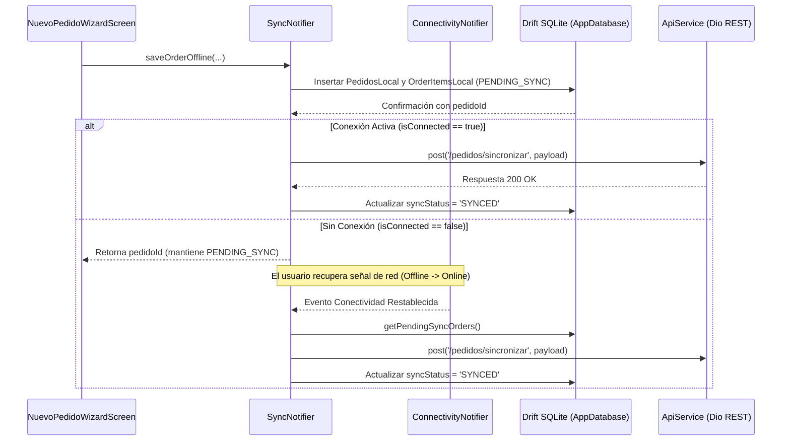

# 🌐 Subdocumento 02: Persistencia Offline-First y Sincronización Automática

Este documento profundiza en la estrategia **Offline-First**, el diseño de la base de datos local **Drift (SQLite)**, la detección de conectividad en tiempo real y el patrón de sincronización en segundo plano de la aplicación de **Preventas**.

---

## 🗄️ 1. Estrategia Offline-First

En el trabajo de campo de preventa comercial, la conectividad a Internet suele ser inestable o inexistente. La aplicación aplica el principio **Offline-First**:

- **Operatividad Sin Conexión:** La creación de pedidos, la consulta de clientes y el catálogo de productos no dependen de la disponibilidad de red.
- **Transaccionalidad Local:** Toda acción de guardado se escribe inmediatamente en la base de datos relacional en el dispositivo (Drift SQLite).
- **Sincronización Transparente:** La aplicación sincroniza en segundo plano de manera automática sin bloquear la interacción del preventista.

---

## 🛢️ 2. Estructura de la Base de Datos Local (`AppDatabase`)

Ubicación: [`lib/data/datasources/local/app_database.dart`](file:///c:/Projects/Frontend/flutter/preventas/lib/data/datasources/local/app_database.dart)

### A. Tabla `PedidosLocal`
Almacena la cabecera de los pedidos generados localmente.

| Columna | Tipo Drift | Descripción / Restricción |
| :--- | :--- | :--- |
| `id` | `IntColumn` | Auto-incremental (`autoIncrement`) |
| `cliente` | `TextColumn` | Nombre y Razón Social del cliente |
| `condicionVenta` | `TextColumn` | 'CONTADO', 'CTA_CTE' (por defecto 'CONTADO') |
| `reparto` | `TextColumn` | Zona o código de reparto |
| `totalMonto` | `RealColumn` | Monto total acumulado del pedido |
| `fechaGeneracion` | `TextColumn` | Fecha legible dd/mm/yyyy |
| `syncStatus` | `TextColumn` | Estado: `'PENDING_SYNC'`, `'SYNCED'`, `'SYNC_ERROR'` |
| `syncErrorMessage` | `TextColumn` | Detalle del error en caso de falla remota |
| `createdAt` | `DateTimeColumn` | Timestamp de creación local |

### B. Tabla `OrderItemsLocal`
Almacena el detalle de los productos incluidos en cada pedido local.

| Columna | Tipo Drift | Descripción / Restricción |
| :--- | :--- | :--- |
| `id` | `IntColumn` | Auto-incremental |
| `pedidoLocalId` | `IntColumn` | Clave foránea referenciando `PedidosLocal.id` (`KeyAction.cascade`) |
| `codigo` | `TextColumn` | Código de producto |
| `descripcion` | `TextColumn` | Nombre y descripción del artículo |
| `cantidad` | `IntColumn` | Cantidad solicitada |
| `precioUnitario` | `RealColumn` | Precio unitario aplicado |
| `descuento` | `RealColumn` | Porcentaje o monto de descuento |
| `total` | `RealColumn` | Subtotal (`cantidad * precio - descuento`) |

---

## 🔌 3. Detección de Conectividad (`ConnectivityNotifier`)

Ubicación: [`lib/presentation/notifiers/connectivity_notifier.dart`](file:///c:/Projects/Frontend/flutter/preventas/lib/presentation/notifiers/connectivity_notifier.dart)

- **Librería Utilizada:** `connectivity_plus: ^6.1.5`
- **Funcionamiento:** Escucha la corriente de eventos `Connectivity().onConnectivityChanged`.
- **Modo Simulación:** Ofrece un método `toggleManualSimulatedState()` para probar el comportamiento offline en entornos de desarrollo o simuladores sin desconectar la placa de red.
- **Visualización en UI:** Expone el getter `isConnected` que la cabecera `PreventaAppBar` utiliza para cambiar el color del icono de la nube:
  - **🟢 Verde (`#4CAF50`):** Conexión activa a Internet.
  - **⚪ Blanco (`Colors.white`):** Sin conexión (Modo Offline).

---

## 🔄 4. Coordinación de Sincronización (`SyncNotifier`)

Ubicación: [`lib/presentation/notifiers/sync_notifier.dart`](file:///c:/Projects/Frontend/flutter/preventas/lib/presentation/notifiers/sync_notifier.dart)

---

## 🏷️ 5. Distinción entre Estados de Negocio y Estados de Sincronización

La aplicación mantiene una estricta separación de responsabilidades entre el ciclo de vida comercial del pedido y su estado de transporte:

- **Estados de Negocio (Backend / Oracle APEX):**
  - `'NUEVO'`: Estado inicial asignado a todo pedido recién creado por el preventista.
  - `'PENDIENTE'`: Pedido en curso o en espera de validación administrativa.
  - `'FINALIZADO'`: Pedido despachado, facturado o cerrado administrativamente.
- **Estados de Sincronización Local (Móvil):**
  - `'SYNCED'` / `'ONLINE'`: Pedido transmitido exitosamente a la API remota.
  - `'PENDING_SYNC'` / `'OFFLINE'`: Pedido creado en el dispositivo sin conexión, almacenado localmente y en espera de conexión para ser enviado automáticamente.

---

## 🔒 6. Almacenamiento Seguro de Credenciales y Sesión Offline (`SecureStorageService`)

- **Persistencia Cifrada:** Utiliza `FlutterSecureStorage` (Keychain en iOS, Keystore cifrado AES en Android y SharedPreferences en Windows) para almacenar el JWT con vigencia de 8 horas.
- **Hash Seguro de Credenciales:** Mediante [`HashUtil`](file:///c:/Projects/Frontend/flutter/preventas/lib/core/utils/hash_util.dart) (SHA-256 con salt), se resguarda el hash de la última combinación de Organización, Usuario y Contraseña validada exitosamente online.
- **Validación Offline:** Al ingresar sin conexión, el sistema compara el hash local y valida que el JWT no haya expirado, garantizando operatividad segura aún en modo avión.

---

## 💡 Patrones de Diseño Aplicados

1. **Patrón Observer:** `SyncNotifier` observa los cambios en `ConnectivityNotifier` y reacciona de inmediato ante transiciones de red.
2. **Patrón Transacción:** El guardado del pedido y sus N artículos se realiza atómicamente para asegurar consistencia.
3. **Patrón Anti-Corruption Layer (ACL):** `SyncRepositoryImpl` transforma las entidades relacionales locales en DTOs JSON antes de enviarlos a la API remota.
