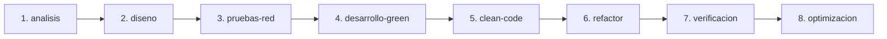

# ⚡ Subdocumento 04: Arnés de Desarrollo, Ciclo de Vida y Modo Watcher

Este documento detalla el funcionamiento del **Arnés de Desarrollo** (`tool/harness.dart`), una herramienta CLI personalizada que automatiza el ciclo de desarrollo TDD/BDD, la validación estática, la protección de ramas mediante Git Hooks y la ejecución en modo observador continuo.

---

## 🔁 1. Las 8 Fases del Arnés de Desarrollo

El arnés obliga al equipo a seguir una metodología rigurosa basada en **BDD** (Behavior-Driven Development) y **TDD** (Test-Driven Development):



### Detalle por Fase:

1. **`analisis`:**
   - Genera la especificación BDD (`specs/features/<feature>.feature`) y la bitácora (`docs/knowledge/control_avance_<feature>.md`).
2. **`diseno`:**
   - Define el diseño técnico, las estructuras de datos y los contratos inmutables (`types.dart`).
3. **`pruebas-red` (Fase RED - TDD):**
   - Escribe las pruebas unitarias y de widgets que validan el requerimiento antes de escribir la implementación. Se verifica que las pruebas **fallen** de forma esperada.
4. **`desarrollo-green` (Fase GREEN - TDD):**
   - Escribe la implementación mínima necesaria para que todas las pruebas pasen a **verde** (`All tests passed!`).
5. **`clean-code`:**
   - Aplica el formateador de código (`dart format .`) y ejecuta el análisis estático (`flutter analyze`).
6. **`refactor`:**
   - Permite limpiar y optimizar el código manteniendo la suite de pruebas activa para evitar regresiones.
7. **`verificacion`:**
   - Ejecuta la verificación integral del sistema y compila artefactos.
8. **`optimizacion`:**
   - Mide los tiempos de ejecución de los tests garantizando un rendimiento `≤500ms`.

---

## 👁️ 2. Modo Observador Continuo (`--watch` / `-w`)

Ubicación: [`tool/harness.dart`](file:///c:/Projects/Frontend/flutter/preventas/tool/harness.dart)

El arnés incorpora un observador (*watcher*) en tiempo real:

```bash
dart run tool/harness.dart --watch
# o en su sintaxis corta:
dart run tool/harness.dart -w
```

### Funcionamiento del Watcher:
- Monitorea constantemente los cambios en las carpetas `lib/` y `test/`.
- Al guardar cualquier archivo Dart, dispara automáticamente la suite de pruebas `flutter test` en segundo plano sin reiniciar la consola.
- Permite la retroalimentación inmediata (*instant feedback loop*) durante la refactorización.

---

## 🛡️ 3. Protección de Ramas y Git Hooks (`pre-push`)

El arnés incluye una salvaguarda para evitar que código de prueba o archivos temporales de desarrollo lleguen a entornos productivos o de testing de QA:

```bash
# Instalación de hooks en la carpeta .git/hooks/
dart run tool/harness.dart --install-hooks
```

### Matriz de Aislamiento de Entornos:

| Entorno / Rama Git | Arnés Habilitado | Artefactos (`specs/`, `.harness_state.json`) | Hook `pre-push` |
| :--- | :---: | :---: | :---: |
| **`develop` / `feature/*`** | ✅ Habilitado | Permitido trabajo local | Pasa verificación local |
| **`qa` / `release/*`** | ❌ Bloqueado | Excluido por `.gitattributes` | Rechaza push con artefactos dev |
| **`main` / `master`** | ❌ Bloqueado | Excluido por `.gitattributes` | Rechaza push con artefactos dev |

### Comando de Preparación para Despliegue:
Antes de crear una solicitud de extracción (*Pull Request*) o fusionar hacia `qa`:
```bash
dart run tool/harness.dart --prepare-deploy qa
```
Este comando limpia automáticamente la base de datos temporal `.harness_state.json` y ejecuta el análisis estático final.
