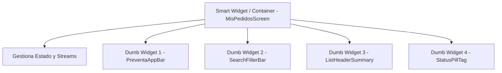

# 🎨 Subdocumento 07: Estándares de Código, Patrones de UI y Descomposición de Widgets

Este documento aborda las convenciones de diseño visual, la paleta de colores corporativa, los estándares de codificación SOLID y el patrón de descomposición atómica de widgets (**Atomic Design / Smart vs. Dumb Widgets**) aplicado en la aplicación de **Preventas**.

---

## 🎨 1. Sistema de Diseño Visual y Colores (`AppColors` & `AppStyles`)

Para mantener cohesión en la interfaz a lo largo de las 10 pantallas del sistema, los estilos visuales están centralizados:

### A. Paleta de Colores (`AppColors`)
Ubicación: [`lib/core/theme/app_colors.dart`](file:///c:/Projects/Frontend/flutter/preventas/lib/core/theme/app_colors.dart)

- **Rojo Primario Preventas:** `#D32F2F` (Utilizado en cabeceras `PreventaAppBar`, botones de confirmación y destacados).
- **Verde Éxito / Online:** `#4CAF50` (Utilizado en badges activos e icono de nube con señal).
- **Naranja Advertencia / Pendiente:** `#FF9800` (Utilizado en badges `PENDIENTE SYNC` y avisos).
- **Gris Neutral / Bordes:** `#E0E0E0` / `#CCCCCC` (Bordes de tarjetas y divisores).
- **Fondo General:** `#F5F5F5` (Fondo gris claro para contraste de tarjetas blancas).

### B. Estilos Tipográficos y Tarjetas (`AppStyles`)
Ubicación: [`lib/core/theme/app_styles.dart`](file:///c:/Projects/Frontend/flutter/preventas/lib/core/theme/app_styles.dart)

- `AppStyles.cardDecoration(...)`: Genera tarjetas blancas con sombras suaves y bordes de 4px-8px.
- `AppStyles.headerTitleStyle`: Tipografía `Roboto` / `Inter` en negrita (16px, blanco).
- `AppStyles.sectionTitleStyle`: Subtítulos de sección en negrita (14px, `#212121`).

---

## 🧱 2. Patrón de Descomposición Atomica de Widgets (Smart vs. Dumb Widgets)

Widgets extensos que superan las 150 líneas provocan código difícil de mantener y retrabajos en pruebas. La aplicación aplica **Widget Extraction**:

### Componentes Comunes Reutilizables (`lib/presentation/widgets/common/`):

1. **[`PreventaAppBar`](file:///c:/Projects/Frontend/flutter/preventas/lib/presentation/widgets/common/preventa_app_bar.dart):**
   - Cabecera unificada.
   - **Regla de Orden:** Botón Hamburguesa (`Icons.menu`) a la extrema izquierda, seguido del botón de retorno (`Icons.arrow_back`) a su derecha cuando la pantalla permite `pop`.
   - **Indicador Dinámico:** Muestra el estado de red de `ConnectivityNotifier` con icono de nube (Verde = Online, Blanco = Offline).
   - **Prevención de Overflow:** Ancho adaptativo `leadingWidth: canPop ? 104 : 52` e iconos de tamaño compacto (36x36px).

2. **[`PreventaDrawer`](file:///c:/Projects/Frontend/flutter/preventas/lib/presentation/widgets/common/preventa_drawer.dart):**
   - Menú lateral deslizante con cabecera roja corporativa, información del usuario autenticado, accesos directos a los 6 módulos y opción de Cierre de Sesión.

3. **[`SearchFilterBar`](file:///c:/Projects/Frontend/flutter/preventas/lib/presentation/widgets/common/search_filter_bar.dart):**
   - Barra de búsqueda estandarizada con campo de texto e icono/botón "Ir" integrado.

4. **[`ListHeaderSummary`](file:///c:/Projects/Frontend/flutter/preventas/lib/presentation/widgets/common/list_header_summary.dart):**
   - Fila de recuento dinámico de elementos ("X filas encontradas").

5. **[`StatusPillTag`](file:///c:/Projects/Frontend/flutter/preventas/lib/presentation/widgets/common/status_pill_tag.dart):**
   - Etiquetas/Pills redondeadas con fondo suave y texto en negrita para resaltar estados (`Activo`, `En Curso`, `Pendiente`).

### Componentes Modulares de Pedidos (`lib/presentation/widgets/pedidos/`):

1. **[`PedidosSyncBanner`](file:///c:/Projects/Frontend/flutter/preventas/lib/presentation/widgets/pedidos/pedidos_sync_banner.dart):**
   - Banner de advertencia que gestiona de manera aislada la sincronización on-demand de pedidos guardados en Hive.
2. **[`PedidosFilterBar`](file:///c:/Projects/Frontend/flutter/preventas/lib/presentation/widgets/pedidos/pedidos_filter_bar.dart):**
   - Buscador por texto, panel desplegable de filtros de estado/origen y botón de restablecimiento de filtros.
3. **[`PedidosTableView`](file:///c:/Projects/Frontend/flutter/preventas/lib/presentation/widgets/pedidos/pedidos_table_view.dart):**
   - Renderizado en formato `DataTable` con scroll horizontal para tablet y escritorio.
4. **[`PedidosCardView`](file:///c:/Projects/Frontend/flutter/preventas/lib/presentation/widgets/pedidos/pedidos_card_view.dart):**
   - Tarjetas apiladas adaptadas a pantallas móviles angostas (< 600px).
5. **[`PedidoOriginBadge` y `PedidoStatusBadge`](file:///c:/Projects/Frontend/flutter/preventas/lib/presentation/widgets/pedidos/pedido_badges.dart):**
   - Badges visuales reutilizables para origen (`ONLINE`/`OFFLINE`) y estado comercial (`NUEVO`, `PENDIENTE`, `FINALIZADO`).

---

## 📐 3. Principios SOLID Aplicados en el Código

1. **Single Responsibility Principle (SRP):** Demostrado en la refactorización de [`MisPedidosScreen`](file:///c:/Projects/Frontend/flutter/preventas/lib/presentation/screens/mis_pedidos_screen.dart) (reducida de >1.100 a <170 líneas), desacoplando los modelos hacia [`pedido_item_model.dart`](file:///c:/Projects/Frontend/flutter/preventas/lib/data/models/pedido_item_model.dart), la lógica de red/filtrado hacia [`PedidosNotifier`](file:///c:/Projects/Frontend/flutter/preventas/lib/presentation/notifiers/pedidos_notifier.dart) y la interfaz visual hacia componentes modulares independientes.
2. **Open/Closed Principle (OCP):** Los componentes comunes aceptan parámetros configurables (`title`, `showBackButton`, `onSearch`) permitiendo extender su comportamiento sin modificar el código fuente interno.
3. **Liskov Substitution Principle (LSP):** `SyncRepositoryImpl` puede ser sustituido por `FakeSyncRepository` en pruebas sin romper la capa de presentación.
4. **Interface Segregation Principle (ISP):** Las interfaces de repositorio están segregadas por ámbito (`AuthRepository`, `SyncRepository`), evitando obligar a un notificador a depender de métodos de autenticación que no utiliza.
5. **Dependency Inversion Principle (DIP):** Las pantallas y notificadores dependen de abstracciones (`SyncRepository`), no de implementaciones de bajo nivel.

