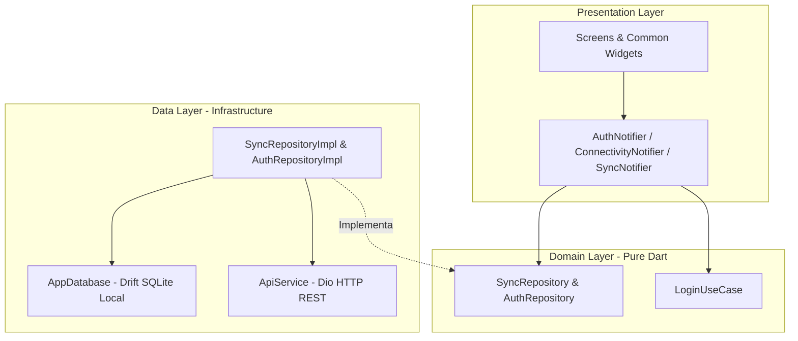

# 📘 Manual del Desarrollador: Aplicación de Preventas (Índice Maestro)

Bienvenido al **Manual del Desarrollador** de la aplicación móvil de **Preventas**. Este documento actúa como el **Índice Maestro** que estructura y organiza los 7 subdocumentos especializados que detallan la arquitectura del software, la persistencia offline, el stack técnico, el arnés de desarrollo, las variables de entorno, la inicialización local y los estándares visuales y SOLID.

---

## 🗂️ Índice de Subdocumentos Detallados

Haga clic en cualquiera de los enlaces a continuación para acceder al análisis en profundidad y a la justificación de los patrones de diseño aplicados:

1. **[📐 01. Arquitectura del Sistema, Capas y Patrones de Diseño](file:///c:/Projects/Frontend/flutter/preventas/docs/manual/01_arquitectura_y_capas.md)**
   - Detalle de **Clean Architecture**, separación en capas (Presentación, Dominio, Datos), flujo de dependencias (*Inward-Only*), Principio de Inversión de Dependencias (DIP) y patrones Repositorio, Caso de Uso, Inyección de Dependencias y Observador.

2. **[🌐 02. Persistencia Offline-First y Sincronización Automática](file:///c:/Projects/Frontend/flutter/preventas/docs/manual/02_persistencia_y_sincronizacion.md)**
   - Estrategia **Offline-First**, diseño de las tablas `PedidosLocal` y `OrderItemsLocal` en **Drift (SQLite)**, monitoreo de red con `ConnectivityNotifier`, coordinación en segundo plano con `SyncNotifier` y diagramas de secuencia.

3. **[🛠️ 03. Stack Técnico, Librerías y Justificación de Tecnologías](file:///c:/Projects/Frontend/flutter/preventas/docs/manual/03_stack_tecnico_y_dependencias.md)**
   - Matriz de tecnologías (`Flutter 3.11`, `Provider`, `Dio`, `Drift`, `Connectivity Plus`, `Dotenv`) y justificación técnica comparativa (ej: Provider vs. BLoC, Drift vs. Hive/SharedPreferences, Dio vs. http).

4. **[⚡ 04. Arnés de Desarrollo, Ciclo de Vida y Modo Watcher](file:///c:/Projects/Frontend/flutter/preventas/docs/manual/04_arnes_de_desarrollo_y_fases.md)**
   - Las 8 fases del arnés (`tool/harness.dart`), modo observador continuo (`--watch` / `-w`), protección de ramas con Git Hooks (`pre-push`) y aislamiento por entornos (`dev`, `qa`, `main`).

5. **[🔑 05. Variables de Entorno y Configuración del Sistema](file:///c:/Projects/Frontend/flutter/preventas/docs/manual/05_variables_de_entorno_y_configuracion.md)**
   - Gestión del archivo `.env`, inyección segura en tiempo de ejecución con `flutter_dotenv`, inicialización en pruebas unitarias y estrategias multiam biente (Dev, QA, Prod).

6. **[🚀 06. Guía de Inicialización Local, Compilación y Despliegue](file:///c:/Projects/Frontend/flutter/preventas/docs/manual/06_guia_inicializacion_y_despliegue.md)**
   - Prerrequisitos, instalación de dependencias, generación de código de Drift con `build_runner`, ejecución en Android (dispositivo físico USB), Windows nativo y Web (Chrome).

7. **[🎨 07. Estándares de Código, Patrones de UI y Descomposición](file:///c:/Projects/Frontend/flutter/preventas/docs/manual/07_estandares_patrones_ui_descomposicion.md)**
   - Sistema de diseño visual (`AppColors`, `AppStyles`), descomposición atómica (*Smart vs. Dumb Widgets*), componentes comunes (`PreventaAppBar`, `PreventaDrawer`, `SearchFilterBar`, `ListHeaderSummary`, `StatusPillTag`) y cumplimiento de principios SOLID.

---

## 📊 Resumen General de Arquitectura

